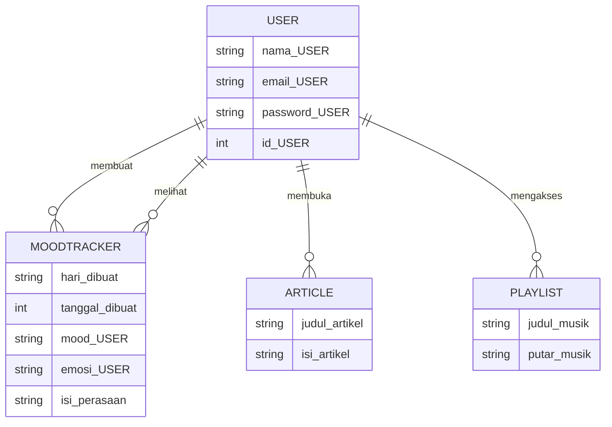
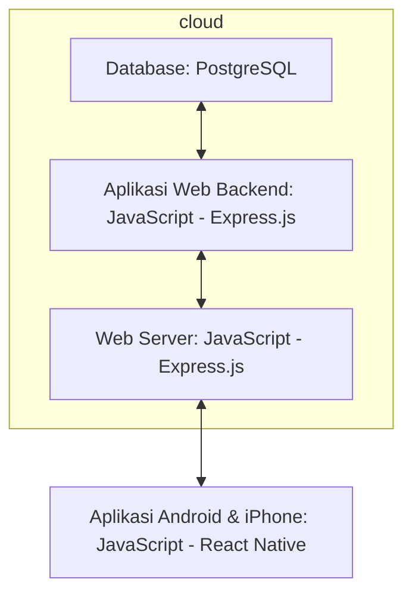

## HiSafe App

## 1.1 Latar Belakang

Menurut hasil Sensus Penduduk tahun 2020, penduduk Indonesia didominasi oleh generasi Z yaitu mencapai sekitar 74,39 juta orang atau 27,94% dari total penduduk Indonesia. Generasi Z disebut-sebut sebagai generasi yang memiliki mental yang lemah, mereka juga rentan mengalami apa yang dinamakan dengan Gangguan Kesehatan Mental. Tidak jarang, banyak kasus bunuh diri, self harm, bahkan melukai dan mengganggu sesama karena perasaan mental mereka yang tidak baik. Penyebab utamanya kebanyakan dari keadaan lingkungan, keadaan keluarga, dan juga tidak memiliki solusi akan masalah yang sedang dihadapi. Alasan lain generasi Z dianggap memiliki mental yang lebih lemah adalah karena kebutuhan sosial yang tidak terpenuhi, termasuk pendapatan, pendidikan tinggi, pekerjaan, makanan yang lebih baik, perumahan mewah, transportasi yang nyaman, dukungan sosial, keamanan, dan lain-lain. Banyak orang yang bisa mengatasi kesehatan mentalnya dengan berkonsultasi kepada orang yang ahli dalam bidang tersebut ataupun mengikuti terapi dengan harga yang tidak murah. Namun hal tersebut berbeda bagi sebagian orang yang memiliki masalah kesehatan mental tetapi tidak mempunyai dana untuk mengatasi masalah kesehatan mentalnya. Alhasil mereka membiarkan kesehatan mental mereka kacau ataupun berusaha untuk mengatasinya namun dengan minim informasi. Dari permasalahan tersebut, saya mendapatkan inspirasi untuk membuat sebuah aplikasi guna mengurangi terjadinya hal yang tidak diinginkan disebabkan kesehatan mental yang terganggu, dan tentunya murah bahkan gratis jika masalah yang diderita tidak terlalu serius. Maka lahirlah aplikasi HiSafe guna mengatasi hal-hal tersebut. Dalam pengembangannya, HiSafe diharapkan mampu menyediakan segala hal mengenai kesehatan mental yang mampu membantu semua pengguna khususnya pengguna yang telah ditargetkan. Sebagai pembuat aplikasi ini, saya sangat menerima pendapat-pendapat pengguna untuk pengembangan aplikasi ini untuk meningkatkan kenyamanan penggunanya.

## 1.2. Deksripsi Teknologi Informasi

HiSafe merupakan aplikasi kesehatan mental dengan berbagai fitur yang dapat memenuhi kebutuhan penggunanya dengan tampilan yang sederhana, simpel, dan lengkap. Salah satu fiturnya adalah Artikel, berguna bagi pengguna agar bisa mendapatkan informasi mengenai kesehatan mental seperti tips, fakta, maupun berita yang sedang hangat dan tentunya berkaitan dengan kesehatan mental. Selanjutnya adalah fitur Mood Tracker, berguna untuk menyimpan mood dan melihat perkembangan mood dalam interval waktu tertentu. Selain itu, HiSafe juga menyediakan fitur Playlist, berguna untuk merelaksasi pikiran dengan musik-musik yang tenang. Dengan menggunakan aplikasi ini secara rutin dan mengikuti tips-tips berguna dari konselor, pengguna dapat merasakan perubahan pada diri menjadi lebih baik.

## 1.3. Branding

- Merk: HiSafe
- Tagline: A Place to rest for a moment, to calm your heart and mind
- Campaign: Aplikasi yang membuat penggunanya dapat menemukan dan mengatasi masalah kesehatan mental dimulai dari langkah kecil.
- Target user:
  - Usia 13+ (Remaja)
  - Seorang yang memiliki masalah mental
  - Seorang yang peduli akan kesehatan mental
  - Seorang yang ingin mencoba mengatasi masalah mental dari langkah sederhana
  - Seorang yang ingin menenangkan pikirannya
  - Seorang yang ingin berbagi solusi bagi orang lain
  - Seorang yang ingin memberikan motivasi bagi orang lain
  - Seorang yang ingin mengelola progres mood dari jangka waktu tertentu
  - Seorang yang ingin memperbaiki diri menjadi lebih baik
  - Seorang yang ingin konsultasi dengan psikolog dari jarak jauh
- User experience theme:
  - Sederhana
  - Lengkap
  - Mudah
  - Warna: forest tone (soft green, green, white, brown)
  - Inspirasi desain: 

## 2. User Story

| No | Sebagai | Saya ingin bisa | Sehingga | Prioritas |
| ----- | ------ | ------ | ------ | ------ |
| 1 | Pengguna | Melihat artikel tentang mental health | Dapat mengetahui informasi tentang mental health | 🔱🔱🔱🔱🔱 |
| 2 | Pengguna | Melihat progres mood | Dapat mengetahui perkembangan mood dari beberapa hari ke belakang | 🔱🔱🔱🔱🔱 |
| 3 | Pengguna | Memutar playlist meditasi | Dapat mendengarkan musik yang membuat pikiran tenang | 🔱🔱🔱🔱 |
| 4 | Pengguna | Membuat thread | Dapat menceritakan pengalaman dan meminta pendapat pengguna lain | 🔱🔱🔱 |
| 5 | Pengguna | Membalas thread | Dapat memberikan pendapat kepada pengguna lain | 🔱🔱🔱 |
| 6 | Pengguna | Melihat thread | Dapat mengetahui informasi baik dari thread sendiri maupun thread pengguna lain | 🔱🔱🔱 |
| 7 | Pengguna | Melihat profil | Dapat mengetahui informasi mengenai akun atau profil sendiri | 🔱🔱🔱🔱 |
| 8 | Pengguna | Mengubah profil | Dapat mengubah informasi mengenai akun diri sendiri | 🔱🔱🔱🔱 |
| 9 | Pengguna | Menghubungi Konselor | Dapat melakukan konsultasi dengan konselor melalui fitur chat | 🔱🔱🔱🔱 |
| 10 | Pengguna | Membuat janji | Dapat bertemu dengan konselor secara langsung untuk konsultasi | 🔱🔱🔱 |
| 11 | Pengguna | Mendapatkan notifikasi artikel | Dapat menerima informasi terbaru mengenai artikel yang relevan | 🔱🔱 |
| 12 | Pengguna | Mendapatkan notifikasi pengingat | Dapat dengan cepat mengisi mood tracker dari pengingat | 🔱🔱 |
| 13 | Konselor | Membuat thread | Dapat memberikan cerita motivasi kepada pengguna lain | 🔱🔱🔱 |
| 14 | Konselor | Melihat thread | Dapat mengetahui informasi baik dari thread sendiri maupun thread pengguna lain | 🔱🔱🔱 |
| 15 | Konselor | Melihat profil | Dapat mengetahui informasi mengenai akun atau profil sendiri | 🔱🔱🔱 |
| 16 | Konselor | Mengubah profil | Dapat mengubah informasi mengenai akun diri sendiri | 🔱🔱 |
| 17 | Konselor | Menerima pesan | Dapat berinteraksi dengan pengguna | 🔱🔱🔱🔱 |
| 18 | Konselor | Membuat artikel | Dapat membagikan informasi lengkap kepada pengguna maupun konselor lain | 🔱🔱🔱 |
| 19 | Konselor | Membuat janji | Dapat bertemu dengan pengguna secara langsung untuk konsultasi | 🔱🔱🔱 |
| 20 | Konselor | Mengubah playlist | Dapat menambahkan atau menghapus lagu sesuai playlist yang ada | 🔱🔱 |

## 3. Struktur Data

## 4. Arsitektur Sistem

Ideal Flowchart

Now Flowchart

## 5. Teknologi, Library, dan Framework

*Teknologi
Beberapa teknologi yang digunakan yakni:
- Figma (sebagai pembuat design ui dan ux)
- React Native (sebagai pembuat aplikasi android)
- Dribble (sebagai tempat menyimpan gambar untuk keperluan pembuatan aplikasi)
- Canva (untuk membuat design logo)
- Mermaid.js (untuk membuat struktur data dan juga flowchart arsitektur sistem)
*Library
*Framework

## 6. Desain User Experience dan User Interface

 

## 7. Demonstrasi Video

Link youtube nya

## 8. Bagaimana mesin komputasi dan sistem operasi berperan dalam produk teknologi informasimu ?

Link youtube nya di detik jawaban ini

## 9. Bagaimana algoritma, struktur data, dan bahasa pemrograman berperan dalam produk teknologi informasimu ?

Link youtube nya di detik jawaban ini

## 10. Bagaimana metode pengembangan perangkat lunak / Software Development Life Cycle berperan dalam produk teknologi informasimu ?

Link youtube nya di detik jawaban ini

## 11. Bagaimana database / sistem basis data berperan dalam produk teknologi informasimu ?

Link youtube nya di detik jawaban ini
